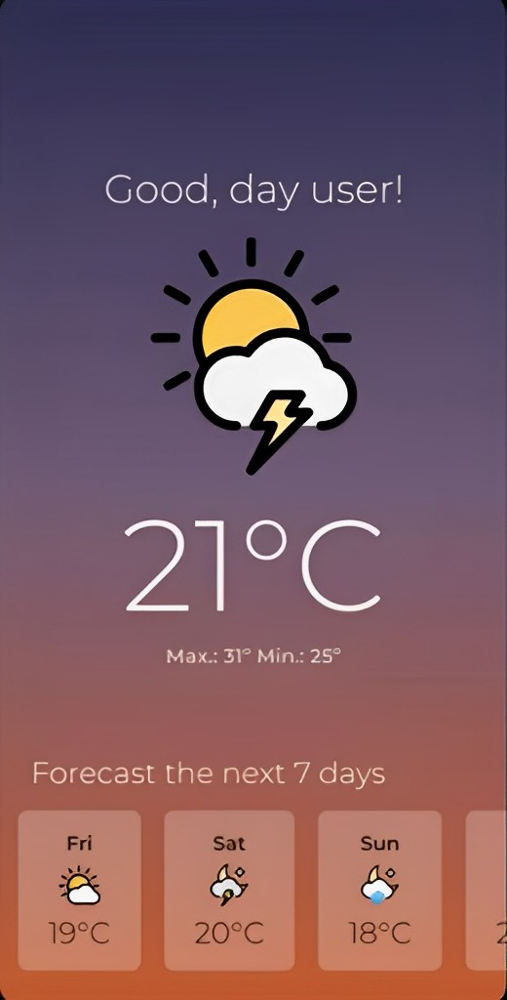

<h1 align="center">
App Clima 🌤️

<h3 align="center">
Feito em React Native. 

### Projeto Design ONBOARDING ⬇️

<a href="https://www.linkedin.com/in/adrianabeatriz3">
 <b>Adriana Beatriz</b></a>  <a href="https://www.linkedin.com/in/adrianabeatriz3" title="LinkedIn">🚀</a>

 ### Estrutura de arquivos:

 appClima/  
├─ assets/  
│  └─ images/   (ícones e imagens usadas no app)  
├─ src/  
│  ├─ assets  
│  └─ screens/home

  Entre em contato!👋🏽  

 
 
   

